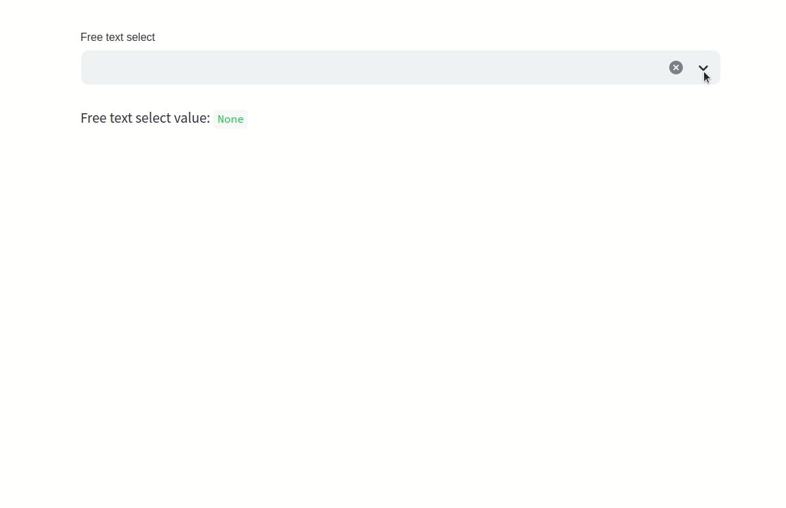

[](https://pepy.tech/projects/streamlit-free-text-select)
[](https://pypi.org/project/streamlit-free-text-select/)


# Streamlit free text select
This component implements a selectbox that allows free text input. It is based on React-Select's 'Select'
component.

## Installation
```bash
pip install streamlit-free-text-select
```

## Usage
```python
import streamlit as st

from streamlit_free_text_select import st_free_text_select

options = ["apple", "banana", "cherry", "date", "elderberry", "fig", "grape"]

value = st_free_text_select(
    label="Free text select",
    options=options,
    index=None,
    format_func=lambda x: x.lower(),
    placeholder="Select or enter a fruit",
    disabled=False,
    delay=300,
    label_visibility="visible",
)
st.write("Free text select value:", value)
```




## Docs
Parameters
- `label` : str
    A short label explaining to the user what this input is for.
- `options` : list
    A list of predefined options to choose from.
- `index` : int
    An optional index to select an option by default, defaults to None.
- `format_func` : callable
    A callable function to format the options, defaults to None.
- `placeholder` : str
    A string to display when the input is empty, defaults to None.
- `disabled` : bool
    Whether the input is disabled, defaults to False.
- `delay` : int
    The time in milliseconds to wait before updating the component, defaults to 300.
- `key` : str
    An optional string to use as the unique key for the widget, defaults to None.
- `label_visibility` : str
    The visibility of the label, defaults to "visible". Options are "visible", "hidden", "collapsed".

Returns
str or None
    The value of the free text select input.

## Contributors
<!-- readme: contributors -start -->
<table>
	<tbody>
		<tr>
            <td align="center">
                <a href="https://github.com/hummerichsander">
                    
                    <br />
                    <sub><b>Sander Niels Hummerich</b></sub>
                </a>
            </td>
            <td align="center">
                <a href="https://github.com/kevintcaron">
                    
                    <br />
                    <sub><b>Kevin Caron</b></sub>
                </a>
            </td>
            <td align="center">
                <a href="https://github.com/LorianColtof">
                    
                    <br />
                    <sub><b>Lorian Coltof</b></sub>
                </a>
            </td>
		</tr>
	<tbody>
</table>
<!-- readme: contributors -end -->

## Release Notes
- 0.3.0:
    Enhancement: Support for `disabled=True` and updated styling to match streamlit-1.45.0. by [kevintcaron](https://github.com/kevintcaron)
- 0.2.0:
    Enhancement: Allow dynamic updating of the options. by [LorianColtof](https://github.com/LorianColtof)
- 0.1.2:
    Bug fix: Fixed issue with `index=0` not selecting the first option.
- 0.1.1:
    Added the `label_visibility` and `index` parameters.
- 0.0.5:
    Initial release.
